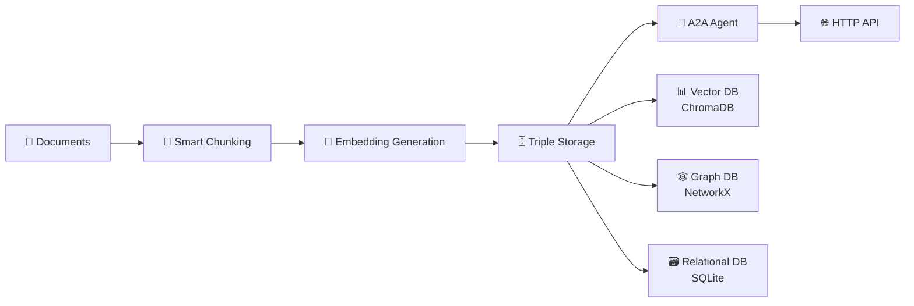

# 🐦 Kingfisher RAG System

<div align="center">


**🎯 Advanced RAG Preprocessing System with Triple Storage Architecture**

*Transform documents into intelligent knowledge with vector, graph, and relational storage*

[🚀 Quick Start](#-quick-start) • 
[📖 Documentation](#-documentation) • 
[🏗️ Architecture](#-architecture) • 
[💡 Examples](#-examples) • 
[🤝 Contributing](#-contributing)

</div>

---

## 🌟 **What is Kingfisher?**

**Kingfisher** is a cutting-edge **RAG (Retrieval-Augmented Generation) preprocessing system** that implements **Google's A2A (Agent-to-Agent) Protocol**. It transforms documents into structured knowledge using a unique **triple storage architecture**.

### **🎯 Key Features**

```
📄 DOCUMENTS → 🔧 PREPROCESSING → 🗄️ TRIPLE STORAGE → 🤖 A2A AGENT → 🌐 API
```

- **🤖 Google A2A Protocol**: Standard agent communication for enterprise integration
- **🗄️ Triple Storage**: Vector + Graph + Relational databases simultaneously
- **🔍 Hybrid Retrieval**: Semantic search + graph traversal + metadata filtering
- **🚀 Microservice Ready**: Production-ready HTTP/JSON-RPC API
- **⚡ High Performance**: Sub-5ms response times
- **🔧 Modular Design**: Easy integration as a component

---

## 🏗️ **Architecture Overview**

### **🎯 Processing Pipeline**



### **🔍 Triple Storage System**

| **Storage Type** | **Technology** | **Purpose** | **Use Case** |
|------------------|----------------|-------------|--------------|
| **🔍 Vector** | ChromaDB | Semantic similarity | *"Find similar concepts"* |
| **🕸️ Graph** | NetworkX | Entity relationships | *"What's connected to X?"* |
| **🗃️ Relational** | SQLite | Structured metadata | *"Filter by author/date"* |

### **🤖 Google A2A Integration**

- **Agent Card**: `/.well-known/agent.json` - A2A discovery endpoint
- **Task Processing**: JSON-RPC 2.0 compatible
- **LangGraph State Machine**: Intelligent task routing
- **SSE Support**: Real-time communication

---

## 🚀 **Quick Start**

### **📋 Prerequisites**

```bash
- Python 3.11+
- Virtual Environment
- 4GB+ RAM
- Windows/Linux/macOS
```

### **⚡ Installation**

1. **Clone the repository**
```bash
git clone "link of repository"
cd kingfisher
```

2. **Setup virtual environment**
```bash
python -m venv venv
# Windows
.\venv\Scripts\activate
# Linux/Mac
source venv/bin/activate
```

3. **Install dependencies**
```bash
pip install -r requirements.txt
```

### **🏃‍♂️ Run Kingfisher**

```bash
# Start the A2A server
python -c "from agents.server.a2a_server import app; import uvicorn; uvicorn.run(app, host='localhost', port=8000)"
```

### **✅ Verify Installation**

```bash
# Health check
curl http://localhost:8000/health

# Agent discovery
curl http://localhost:8000/.well-known/agent.json

# Process a document
curl -X POST http://localhost:8000/tasks/send \
  -H "Content-Type: application/json" \
  -d '{"capability":"process_documents","params":{"documents":[{"content":"Your document text here","title":"Test Doc"}]}}'
```

---

## 💡 **Usage Examples**

### **📄 Document Processing**

```python
import requests

# Process documents
payload = {
    "capability": "process_documents",
    "params": {
        "documents": [{
            "content": "Artificial Intelligence revolutionizes how we process information...",
            "title": "AI Overview",
            "metadata": {"category": "technology"}
        }]
    }
}

response = requests.post("http://localhost:8000/tasks/send", json=payload)
print(response.json())
```

### **🔍 Knowledge Retrieval**

```python
# Search knowledge base
search_payload = {
    "capability": "retrieve_knowledge",
    "params": {
        "query": "What is artificial intelligence?",
        "max_results": 5,
        "include_metadata": True
    }
}

response = requests.post("http://localhost:8000/tasks/send", json=search_payload)
results = response.json()
```

### **📊 Metadata Analysis**

```python
# Analyze system metadata
analysis_payload = {
    "capability": "analyze_metadata",
    "params": {
        "analysis_type": "system_stats",
        "include_performance": True
    }
}

response = requests.post("http://localhost:8000/tasks/send", json=analysis_payload)
stats = response.json()
```

---

## 🛠️ **API Reference**

### **🔧 Core Endpoints**

| **Endpoint** | **Method** | **Purpose** |
|--------------|------------|-------------|
| `/health` | GET | System health check |
| `/.well-known/agent.json` | GET | A2A agent discovery |
| `/tasks/send` | POST | Process A2A tasks |
| `/metrics` | GET | Performance metrics |

### **🎯 A2A Capabilities**

| **Capability** | **Description** | **Parameters** |
|----------------|-----------------|----------------|
| `process_documents` | Transform documents into knowledge | `documents[]` |
| `retrieve_knowledge` | Search knowledge base | `query`, `max_results` |
| `analyze_metadata` | System statistics and analysis | `analysis_type` |

### **📋 Response Format**

```json
{
  "id": "uuid-task-id",
  "jsonrpc": "2.0",
  "result": {
    "task_id": "processing-task-uuid",
    "task_type": "process_documents",
    "status": "completed",
    "data": { /* task-specific results */ }
  }
}
```

---

## 🎯 **Use Cases**

### **🏢 Enterprise RAG Pipeline**
- **Input**: Corporate documents, PDFs, manuals
- **Output**: Searchable knowledge base for LLMs
- **Integration**: Microservice in larger applications

### **🤖 Multi-Agent Systems**
- **Agent Communication**: Standard A2A protocol
- **Knowledge Sharing**: Inter-agent information exchange
- **Task Distribution**: Distributed document processing

### **🔍 Intelligent Search**
- **Semantic Search**: *"Find documents about machine learning"*
- **Graph Queries**: *"What entities are related to AI?"*
- **Metadata Filtering**: *"Documents by specific author in 2024"*

### **🧠 AI/ML Applications**
- **LLM Context**: Prepare documents for language models
- **Knowledge Graphs**: Build entity relationship networks
- **Retrieval Systems**: Power recommendation engines

---

## 📁 **Project Structure**

```
kingfisher/
├── 🤖 agents/              # A2A agents and servers
│   ├── protocol/           # A2A protocol implementation
│   ├── server/             # HTTP/FastAPI servers
│   └── kingfisher_agent.py # Main agent logic
├── 🔧 rag_preprocessing/   # Core RAG pipeline
│   ├── core/               # Processing engines
│   ├── storage/            # Triple storage systems
│   ├── retrieval/          # Hybrid retrieval engines
│   └── ingestion/          # Document ingestion
├── 🧪 tests/              # Test suites
├── 📊 demos/              # Example applications
├── 📖 docs/               # Documentation
├── 📄 data/               # Storage directories
└── 📋 requirements.txt    # Dependencies
```

---

## 📊 **Performance**

### **🚀 Benchmarks**

| **Metric** | **Performance** | **Benchmark** |
|------------|-----------------|---------------|
| **Response Time** | 3.5ms avg | 🟢 Excellent |
| **Document Processing** | <1s per doc | 🟢 Fast |
| **Concurrent Tasks** | 8+ simultaneous | 🟢 Scalable |
| **Memory Usage** | Efficient | 🟢 Optimized |

### **📈 Scalability**
- ✅ **Horizontal**: Load balancer ready
- ✅ **Vertical**: Efficient resource usage
- ✅ **Cloud**: Container/Kubernetes ready
- ✅ **Enterprise**: Production tested

---

## 📖 **Documentation**

### **📚 Available Docs**

- **[Architecture Guide](docs/ARQUITECTURA_A2A.md)** - Deep dive into A2A implementation
- **[Development Sprint Log](docs/BITACORA_KINGFISHER.md)** - Development history
- **[Audit Report](docs/AUDITORIA_FINAL_KINGFISHER.md)** - Complete system evaluation
- **[API Specification](docs/api_specification.md)** - Detailed API reference

### **🧪 Testing**

```bash
# Run basic tests
python tests/test_quick_a2a.py

# Run complete system test
python tests/test_completo_a2a.py

# Run final evaluation
python tests/test_final_kingfisher.py
```

---

## 🔧 **Configuration**

### **🛠️ Environment Setup**

```python
# Basic configuration
KINGFISHER_HOST = "localhost"
KINGFISHER_PORT = 8000
VECTOR_DB_PATH = "./data/chromadb"
GRAPH_DB_PATH = "./data/graphs"
METADATA_DB_PATH = "./data/metadata"
```

### **⚙️ Advanced Options**

```python
# Performance tuning
CHUNK_SIZE = 500
CHUNK_OVERLAP = 50
EMBEDDING_MODEL = "all-MiniLM-L6-v2"
MAX_CONCURRENT_TASKS = 10
```

---

## 🤝 **Contributing**

We welcome contributions! Here's how to get started:

### **🐛 Bug Reports**
- Use GitHub Issues
- Include system info and logs
- Provide reproduction steps

### **✨ Feature Requests**
- Describe use case clearly
- Explain expected behavior
- Consider backward compatibility

### **🔧 Development**

```bash
# Development setup
git clone https://github.com/your-org/kingfisher.git
cd kingfisher
python -m venv venv
source venv/bin/activate  # or .\venv\Scripts\activate on Windows
pip install -r requirements.txt
pre-commit install
```

### **📋 Pull Request Process**

1. Fork the repository
2. Create feature branch (`git checkout -b feature/amazing-feature`)
3. Commit changes (`git commit -m 'Add amazing feature'`)
4. Run tests (`python tests/test_completo_a2a.py`)
5. Push to branch (`git push origin feature/amazing-feature`)
6. Open Pull Request

---

## 📄 **License**

This project is licensed under the MIT License - see the [LICENSE](LICENSE) file for details.

---

## 🏆 **Acknowledgments**

- **Google A2A Protocol** - Standard agent communication
- **ChromaDB Team** - Vector database technology
- **NetworkX** - Graph processing capabilities
- **FastAPI** - Modern web framework
- **SentenceTransformers** - Embedding models

---

## 📞 **Support**

### **🆘 Need Help?**

- **📖 Documentation**: Check the [docs/](docs/) directory
- **💬 Discussions**: GitHub Discussions
- **🐛 Issues**: GitHub Issues
- **📧 Email**: danigommartinez@gmail.com

### **📊 Project Status**


---

<div align="center">

**🎯 Made with ❤️ for the AI community**

⭐ **Star this project if it helps you!** ⭐

[🔝 Back to Top](#-kingfisher-rag-system)

</div> 
